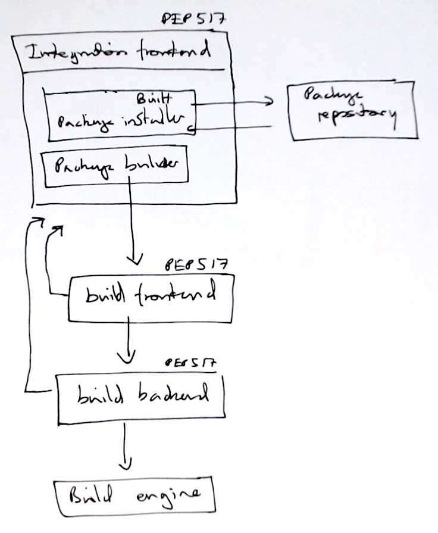

# Distutils is dead, long live ...

This is a discussion of Python packaging as of fall 2021.

In part it is an introduction to what is changing, and a set of pointers for
those who are interested to plan for these changes.

If you want some very high-level advice on what system to use for packaging,
skip all the way to the end.

## Not in this page

This discussion is about the official Python packaging options, designed to
install source or binary packages from the [Python Package
Index](https://pypi.org) or similar. We are not discussing other
packaging systems, where the two major options are:

* [Conda](https://docs.conda.io) or (equivalently)
  [Mamba](https://mamba.readthedocs.io), installing from compatible package
  repositories such as [Anaconda.org](https://anaconda.org) or
  [Conda-forge](https://conda-forge.org) — e.g. `mamba install numpy`.
* Your Linux distribution : e.g. `apt install python-numpy`).

## History

### Distutils

Imagine we start in a directory containing the code for `my_package`.

We will call this directory a *source tree*.  It contains all the source files
necessary for installing the package on any compatible system.  It could be a
checkout from version control, or the result of downloading a source code
archive, and unpacking.

For example, the Python Package Index will nearly always contain a `.tar.gz`
or `.zip` file corresponding to each Python package.  This is the *sdist*
(source distribution) file — or source code archive, as we have used the term
above. When unpacked, it forms a *source tree*.  For example, the [1.21.2
release of the Numpy package on PyPI](https://pypi.org/project/numpy/1.21.2/)
contains a file
[numpy-1.21.2.zip](https://files.pythonhosted.org/packages/3a/be/650f9c091ef71cb01d735775d554e068752d3ff63d7943b26316dc401749/numpy-1.21.2.zip).
When unpacked, this is a source tree for the Numpy 1.21.2 release.

In the beginning, there was:

```bash
python setup.py install
```

In this incarnation, Python has to execute the `setup.py` file in the current
directory, to get the various settings that apply to the package being
installed.

The `setup.py` file would typically have a line like the following:

```python
from distutils.core import setup
```

The `setup.py` file then would call the `setup` function with arguments
defining the files and other features of the package to install.

Distutils' job is relatively simple with a pure-Python package, where the
package contains only Python and data files, but no files in languages other
than Python, which need to be compiled.  In that case Distutils functions as a
simple build system, that works to discover a suitable compiler and assemble
relevant options to the compiler, before calling the compiler and creating
binary files, such as compiled Python extensions.

This quickly became unsatisfactory as a way of installing Python packages,
because it meant you had to download a source file archive or do a version
control checkout, and then run this command from the resulting directory.  If
the package had files for compilation, the user would need the relevant
compilers to be set up correctly on their computer, a particularly difficult
problem on Windows.

Therefore Distutils is, in part, a binary build system, specific to Python.

### Setuptools

Later came the [setuptools package](https://pypi.org/project/setuptools).
This had various useful — but sometimes controversial — extensions to
`distutils`.   Setuptools could work as drop in replacement for Distutils
(although it used parts of Distutils internally).  The `setup.py` function
would now have:

```python
from setuptools import setup
```

This import gives more options for the `setup` function, and various other
utilities for finding packages and so on.

In this use, Setuptools acts as an enhanced version of Distutils — *Setuptools
is Distutils+*.

Setuptools also made a first step at solving the problem of having to download
the code manually, by adding the `easy_install` command - as in `easy_install
my_package`.  This would search the Python Package Index (PyPI) for code
archive files, download, unpack and then install them.

[PEP 632](https://www.python.org/dev/peps/pep-0632) specifies that Python >=
version 3.12 will no longer have the `distutils` module in the standard
library, so we will no longer be able to do `import distutils`.  This will
not have great practical effect on common usage, because Setuptools now
carries the Distutils code, and continues to use its own copy for internal
use. Setuptools will continue to be Distutils+ (with some [minor
exceptions](https://www.python.org/dev/peps/pep-0632/#id23).

### Pip

The next step important step was the release of the [pip
utility](https://pypi.org/project/pip) Package Installer for Python.  This
quickly replaced `easy_install` as the standard tool for installing Python
packages from the command line, especially from PyPI, as in:

```python
pip install my_package
```

As for the earlier `easy_install`, this incantation will search for
`my_package` in the PyPI, download it, unpack and install it correctly in
a suitable directory on the Python search path.

### Wheels

The biggest problem at this point in the story was that Pip always installed
Python packages by downloading a source archive, unpacking it, and then
installing using a mechanism similar to `python setup.py install` above.  This
was completely acceptable for pure Python packages, but impractical for larger
packages that needed compilation.   Very common packages like Scipy or
Matplotlib could take a very long time to compile, and have various external
libraries that they relied on at compile-time. The external libraries had to be
installed before running e.g. `pip install scipy`, in practice by reading and
following the installation instructions.  These pre-installation steps were
fairly complicated and fragile for an inexperienced user.  Again, because Pip
called into Distutils to build compiled code, the user needed a suitable
compiler already installed and configured on their system.

The solution to this problem was the [Wheel format
specification](https://www.python.org/dev/peps/pep-0427).  This defined
a simple zip-file layout to store files that can be directly installed,
including pre-built compiled binaries, such as Python extensions.  Making
a wheel file is relatively simple; it involves preparing the package directory
or directories that will be copied to the Python PATH, along with directories
containing some meta-data about the package(s).

For example, let's say I have simple Python package called
`fakepkg1`, at version 1.0.  If I build a wheel file on Mac I might end up with
a filename something like `fakepkg1-1.0-cp36-abi3-macosx_10_9_universal2.whl`,
and it will likely contain only the following directories:

```
fakepkg1
fakepkg1-1.0.dist-info
```

where the `fakepkg1` directory contains the files that the installer will copy
directly to my Python installation, and the `.dist-info` directory is
a structured set of meta-data about the package.  Notice that that this
particular wheel name tells me and installer tools that this package has binary
files that will run with CPython 3.6 and higher (`cp36-abi3`), on macOS 10.9 or
higher (`macosx_10_9`), and on Intel or M1 architecture (`universal2`).


All this is only to say, wheel files are simple zip files with the files that
will be installed by copying to the Python library installation directories,
and some metadata.

After integration with Pip, and the PyPI, the advent of binary wheels meant
that the release manager for packages like Scipy could build a Wheel for each
platform and Python version they wanted to support.  Each platform and Python
version results in wheel (zip file) with a different specific filename, so that
Pip can identify the wheel corresponding to the system to which it is
installing.  For example, the current (at time of writing) [Scipy 1.71 release
on PyPI](https://pypi.org/project/scipy/1.7.1/) includes [many different Wheel
files](https://pypi.org/project/scipy/1.7.1/#files), corresponding to the
different platforms and Python versions, e.g.:

* `scipy-1.7.1-cp37-cp37m-macosx_10_9_x86_64.whl` for any macOS >= version
  10.9, and Python version 3.7 and
* `scipy-1.7.1-cp39-cp39-win_amd64.whl` for 64-bit Windows and Python 3.9.

We don't go into this here, but wheels that need to work on many different
systems often need some post-processing to vendor and relink external libraries
that the code depends on.  See the [package external libraries
page](./package_external_libraries.md) for more detail.

On way of building wheels is to use the `wheel` subcommand of Pipe, that
accepts a source tree directory (see above) and can build a wheel for the
system on which Pip is running:

```bash
cd my_package
pip wheel .
```

## Separation of concerns

The next big step in packaging has been the realization that Pip and
Setuptools / Distutils are doing various different tasks, and these tasks can
and should be separable.

Tom Kluver's [Flit](https://flit.readthedocs.io) tool was an early development
of this thinking.  Flit is a Python command line package that greatly
simplifies builds of sdists and wheels for pure-Python packages, and does not
use Setuptools or Distutils.

[PEP 517](https://www.python.org/dev/peps/pep-0517/) has a good discussion of
the analysis of various packaging concerns.  The PEP distinguishes the
following tasks within the general umbrella of package management.

* *Integration frontend* - a tool that accepts a set of package requirements,
  and installs these packages on the user's system.  In the command `pip
  install numpy scipy`, pip is acting as an integration frontend.  We can also
  call integration frontends *installers*.
* *Build frontend* - a tool that accepts a source tree (such as an unpackaged
  source code archive or version control checkout), and builds a Wheel or a
  source distribution (sdist). In the command `pip wheel ./`, Pip is acting as
  a build frontend for a wheel. `flit build` has flit acting as a build
  frontend for both wheels and sdists.
* *Build backend* - the tool that the *build frontend* is using to compile the
  files comprising the wheel.   For most packages this will end up being
  Setuptools (Distutils+), but there are other implementations we will come onto soon.

The PEP explains these terms well:

> An *integration frontend* is a tool that users might run that takes a
set of package requirements (e.g. a requirements.txt file) and attempts to
update a working environment to satisfy those requirements. This may require
locating, building, and installing a combination of wheels and sdists. In a
command like `pip install lxml==2.4.0`, pip is acting as an integration
frontend.

> A *build frontend* is a tool that users might run that takes arbitrary
source trees or source distributions and builds wheels from them. The actual
building is done by each source tree's *build backend*. In a command like `pip
wheel some-directory/`, pip is acting as a build
frontend.

We would also distinguish the *build backend* from the *build system*.

The work of the build backend, in building a wheel, is to:

1. *Prepare distribution tree* that has the directories and files as they will
   be installed.
2. *Compile and link* any binary files using suitable compiler and
   compiler flags.
3. *Place binary files* into their correct final locations in the distribution
   tree.
4. *Write meta-data* as a conforming (`.dist-info`) directory for the wheel in
   the distribution tree.
5. *Zip up* the distribution tree to form a wheel.
6. [Post-processing on the wheel](./package_external_libraries.md)

For packages with a lot of compiled code, the *compile and link* step is the
long, hard part of the task.  We call the system to do this work of compiling
and linking — the *build system*.  It's

Notice that the traditional use of Setuptools/Distutils+ means that Setuptools
acts as a build frontend *and* a build backend *and* a build system.
Specifically, traditional packages with compiled code use routines from
Setuptools / Distutils to *call into other routines* in Setuptools / Distutils,
in order to do the work of compiling and linking.  As we will see soon, other
systems use other specialized build systems, such as
[Meson](https://mesonbuild.com/), [CMake](https://cmake.org) and
[SCons](https://scons.org).

PEP 517 was designed to define the standards that make it possible to write
and use new build frontends and backends, so that we (the packagers) no longer
have to use Setuptools (Distutils+).  In particular we can switch out to other build frontends and backends, and we can write our own.

Along with [PEP518](https://www.python.org/dev/peps/pep-0518), PEP517
specifies sections in a configuration file called `pyproject.toml` that define
the build frontend and backend.  PEP517 gives the example of using the `flit` tool as build frontend and build backend, with this configuration (adapted to modern Flit usage):

```yaml
    [build-system]
    # Defined by PEP 518; specifies package(s).
    requires = ["flit"]
    # Defined by this PEP; specifies Python object.
    build-backend = "flit.buildapi"
```

This example says that, in order to build wheels or source distributions (sdists), we

The build backend object must implement at least these Python callables:

* `build_sdist` (builds an sdist).
* `build_wheel` (builds a wheel).

For example, for the example above, the `main` object within `flit.api` must
have calleables `build_wheel` and `build_sdist` (e.g.
`flit.api.main.build_wheel`.

The build backend may also implement these callables:

* `get_requires_for_build_sdist` (returns list of specifications for packages
  that should be installed before running `build_sdist` above).
* `get_requires_for_build_wheel` (returns list of specifications for packages
  that should be installed before running `build_wheel` above).
* `prepare_metadata_for_build_wheel` (prepares `.dist-info` directory
  containing wheel metadata for wheel to be build).

The frontend will always call `build_sdist` to build an sdist, and
`build_wheel` to build a wheel.  It's up to the frontend whether to try
calling the other optional backend functions like
`get_requires_for_build_sdist`.

[PEP 660](https://www.python.org/dev/peps/pep-0660/) added three optional
build backend callables to work with *editable installs*.  Editable installs
are installs where the Python and compiled files for the package being
imported are still in their source tree.  The optional callables are:

* `build_editable`
* `get_requires_for_build_editable`
* `prepare_metadata_for_build_editable`

with the obvious interpretations.  Some build systems, such as Meson, insist on
building outside the source tree, and this will make it very difficult to
support editable installs.

See also [PEP 621](https://www.python.org/dev/peps/pep-0621/) for more specifications for storing project metadata.

## On the integration frontend

The *integration frontend* as defined in PEP517 has two roles, that we want to
distinguish.   First we define a new term -- a *shippable package*.  A
shippable package is a package that needs no or minimal further work to install
into the Python PATH.  Wheels are examples of shippable packages, because they
contain the distribution tree, with all code compiled, as are Conda packages.

Sdists and other source trees are not shippable packages, because the installer
has to work out what extra build steps need to be done, and do them, before
installing the packages.  We call these *source packages*.  In the case of a pure-Python package, this work is very simple, but it is still work.

With that distinction, we refine the tasks that an *integration frontend* has to do.

* *Shippable package installer*.  In this role, the integration frontend
  accepts a list of package requirements, or *shippable package* filenames,
  *resolves* the resulting list of packages that have to be installed,
  including package *dependencies*, then, as necessary *downloads* and
  *installs* the resulting set of packages.   This is how `conda install`
  works, because `conda` packages are always shippable.  Pip performs only this
  role only when all the resulting packages are wheels.
* *Package builder*.  Integration frontends may be asked to install from a
  source tree, or find that they can only get an sdist for a particular
  dependency.  In this case, the integration frontend also functions as, or
  calls into, a *build frontend*.

With this distinction, we see that Conda is a shippable package installer, and
not an integration frontend.  Pip is shippable package installer and a package
builder, and therefore, is an integration frontend.

See the sketchy diagram below for a simple representation of the various parts
PEP517 defines, and that we distinguish here.



Notice that PEP517 specifies that the build frontend can depend on other Python
packages, and, in particular, on the build backend.  Then, the build backend
may install packages that the build depends on.  This means that the build
frontend and the build backend much have access to a shippable package
installer, or a full integration frontend.

## Some backends implementing PEP517

* *Setuptools*.  Have a look at `setuptools.build_meta.__legacy__` for the
  build backend functions above.  The build system depends on what you do in
  your `setup.py` file, but this will typically be the build utilities in
  Setuptools / Distutils.
* *Flit*: `flit.buildapi`. This only handles pure-Python packages, and
  therefore does not need a build system.  Flit contains its own Python code
  for Wheel and sdist creation.
* [Enscons](https://pypi.org/project/enscons): `enscons.api`.  Enscons uses
  Scons as its build system.
* [Mesonpep517 package](https://thiblahute.gitlab.io/mesonpep517):
  `mesonpep517.buildapi`.  Uses Meson as the build system.
* [Mesonpy package](https://github.com/FFY00/mesonpy): `mesonpy` Uses Meson as
  build system.
* [pep517 package](https://pypi.org/project/pep517): `pep517.envbuild`.
* [PDM PEP517](https://pypi.org/project/pdm-pep517): `pdm.pep517.api`.

There is some [discussion of a PEP517 build backend for
scikit-build](https://github.com/scikit-build/scikit-build/issues/124).
Scikit-build uses CMake for code compilation, which would mean that the PEP517
Scikit-build backend would using CMake as a build system, in our terminology.

## PEP517 build frontends

* [Build package](https://github.com/pypa/build): `python -m build`.  The work
  of the frontend is fairly simple, and Build provides a simple implementation that is a reasonable place to start.
* Pip (`pip wheel`).  Although this is a very common way to build wheels, Pip
  only builds wheels, and not sdists.
* Flit (`flit build`). Builds wheels and sdists.  Only builds pure-Python
  packages.
* [pep517 package](https://pypi.org/project/pep517): The high-level build
  calls are now [deprecated](https://github.com/pypa/pep517/pull/83).

## Backends not implementing PEP517

These are backends that replace, extend or hijack the `setup.py` Setuptools backend to do the work of building.  One common option is to extend the Setuptools / Distutils as a *build system*.

* Numpy distutils.  Numpy distutils extends Setuptools / Distutils in various
  ways, including much utility code for dealing with compiling Fortran, and for custom configuration of sub-packages.
* [Scikit-build](https://scikit-build.readthedocs.io): Use with `from skbuild
  import setup` in `setup.py` file.  Scikit-build uses CMake as a build system.

## Integration frontend

For the reasons we have given above, it is reasonable to call integration
frontends — *installers*.

Current popular options are:

* Pip.
* [Poetry](https://python-poetry.org).
* [PDM](https://github.com/pdm-project/pdm)

See [this comparison of Pip and
Poetry](https://stackoverflow.com/a/58218593/1939576), and this [review of
Poetry and PDM
metrics](https://dev.to/frostming/a-review-pipenv-vs-poetry-vs-pdm-39b4) by the
author of PDM.

## Your package, our advice

Perhaps you did not want to know the whole story, you just wanted some current advice.  Or perhaps you want to know the whole story, but not exactly now.  Here is our current advice, as developers with a lot of experience of Python packaging of various sorts:

*   If you have a pure Python package — use Flit.
*   If you have a package with a simple C/Cython extension - (continue to) use
    Setuptools.
*   If you have more complex compiled code, perhaps including Fortran, C++ or
    Rust — use Meson, or CMake via Scikit-build.
